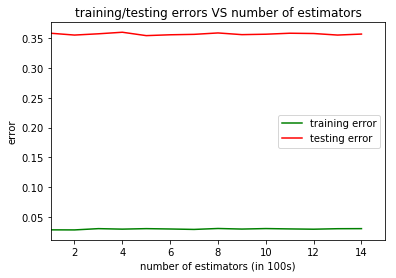
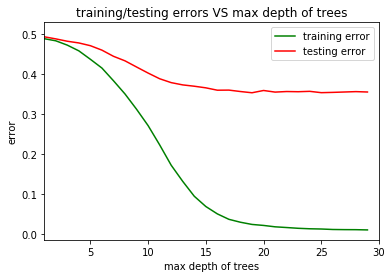
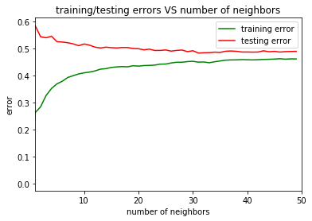

# Predicting Firm-Bank Matching via Machine Learning
In this project, I investigate what kind of banks do firms borrow from. The dataset contains financial status of the firms and the banks that the firms borrows from. Banks are classified into three catogories according to their sizes. I divide the dataset to training sample and testing sample, use the training sample to train a model that predicts which category of banks does a firm borrow from, and check the model precision using the testing sample. <br><br>
In traditional economic research, such problems are usually handled by discrete choice models, e.g., multinomial logit regression. In machine learning, there are many tools designed for classification problems. <br>


```python
import pandas as pd
import numpy as np
import os
import matplotlib.pyplot as plt
from sklearn.ensemble import RandomForestClassifier
from sklearn.impute import SimpleImputer
from pprint import pprint
from sklearn.model_selection import RandomizedSearchCV
from sklearn.linear_model import LogisticRegression
from sklearn.preprocessing import StandardScaler
pd.set_option('display.max_columns', None)

```

# Preprocessing Data


```python
from pathlib import Path
filedir = Path(os.path.dirname(os.path.dirname(os.path.abspath('__file__'))))

```

### Load data and describe 


```python
training_data = pd.read_csv(filedir/"Data"/"trainingsample.csv", dtype={'sic1':str,'sic2':str,'gvkey':str,'year':int})
testing_data = pd.read_csv(filedir/"Data"/"testingsample.csv", dtype={'sic1':str,'sic2':str,'gvkey':str,'year':int})
del testing_data['drop'] 
training_data['train_test'] = 1
testing_data['train_test']=0
# 1: training   0: testing
# this train/test dataset is pre-splitted
all_data = pd.concat([training_data, testing_data])
# the reason to concat the training/test data sample together:
#    some SIC codes only appear in test data sample, this will raise error when predicting
#    concating train/test together will generate SIC dummies that cover all SICs appearing in train/test sample
all_data.describe()
# browsing through the dataset description, you will find there's an issue of missing data
```


<div>
<table border="1" class="dataframe">
  <thead>
    <tr style="text-align: right;">
      <th></th>
      <th>lenderid</th>
      <th>FACILITYID</th>
      <th>year</th>
      <th>MATURITY</th>
      <th>amt</th>
      <th>assets</th>
      <th>cash_assets</th>
      <th>debt_Assets</th>
      <th>cashflow</th>
      <th>be_assets</th>
      <th>TobinQ</th>
      <th>tangibility</th>
      <th>intangibility</th>
      <th>KZ_INDEX</th>
      <th>RD_expense</th>
      <th>zscore</th>
      <th>networth</th>
      <th>MB</th>
      <th>current_at</th>
      <th>retadj</th>
      <th>age</th>
      <th>sales</th>
      <th>dividend</th>
      <th>cat</th>
      <th>count</th>
      <th>numberfacilities</th>
      <th>lendersize</th>
      <th>train_test</th>
    </tr>
  </thead>
  <tbody>
    <tr>
      <th>count</th>
      <td>15020.000000</td>
      <td>15020.000000</td>
      <td>15020.000000</td>
      <td>14646.000000</td>
      <td>15014.000000</td>
      <td>15020.000000</td>
      <td>15018.000000</td>
      <td>15003.000000</td>
      <td>14975.000000</td>
      <td>14337.000000</td>
      <td>14325.000000</td>
      <td>14962.000000</td>
      <td>14584.000000</td>
      <td>14216.000000</td>
      <td>15020.000000</td>
      <td>14101.000000</td>
      <td>15006.000000</td>
      <td>14325.000000</td>
      <td>14482.000000</td>
      <td>15020.000000</td>
      <td>14946.000000</td>
      <td>15018.000000</td>
      <td>14944.000000</td>
      <td>14482.000000</td>
      <td>15020.000000</td>
      <td>15020.000000</td>
      <td>15020.000000</td>
      <td>15020.000000</td>
    </tr>
    <tr>
      <th>mean</th>
      <td>31015.657790</td>
      <td>187803.413648</td>
      <td>2005.408988</td>
      <td>47.869248</td>
      <td>503.141934</td>
      <td>11181.263001</td>
      <td>0.088245</td>
      <td>0.322591</td>
      <td>0.126132</td>
      <td>0.437221</td>
      <td>1.626991</td>
      <td>0.573626</td>
      <td>0.232021</td>
      <td>0.697732</td>
      <td>0.018079</td>
      <td>2.323124</td>
      <td>0.387414</td>
      <td>3.652861</td>
      <td>2712.853366</td>
      <td>0.039723</td>
      <td>20.026362</td>
      <td>1.053303</td>
      <td>0.014725</td>
      <td>0.367301</td>
      <td>781.187217</td>
      <td>4672.959920</td>
      <td>2.279827</td>
      <td>0.665779</td>
    </tr>
    <tr>
      <th>std</th>
      <td>31654.629302</td>
      <td>58662.853334</td>
      <td>3.463300</td>
      <td>23.305768</td>
      <td>1056.873323</td>
      <td>38478.145210</td>
      <td>0.109439</td>
      <td>0.219441</td>
      <td>0.109002</td>
      <td>0.189621</td>
      <td>0.918809</td>
      <td>0.399044</td>
      <td>0.213601</td>
      <td>2.123015</td>
      <td>0.047538</td>
      <td>1.937078</td>
      <td>0.239897</td>
      <td>22.256596</td>
      <td>7322.068494</td>
      <td>0.144526</td>
      <td>14.417968</td>
      <td>0.782511</td>
      <td>0.055541</td>
      <td>0.205876</td>
      <td>833.365906</td>
      <td>4122.717152</td>
      <td>0.800280</td>
      <td>0.471733</td>
    </tr>
    <tr>
      <th>min</th>
      <td>2446.000000</td>
      <td>71115.000000</td>
      <td>2000.000000</td>
      <td>1.000000</td>
      <td>0.000000</td>
      <td>4.265000</td>
      <td>0.000000</td>
      <td>0.000000</td>
      <td>-3.574248</td>
      <td>0.000218</td>
      <td>0.233193</td>
      <td>0.000000</td>
      <td>0.000000</td>
      <td>-92.630480</td>
      <td>0.000000</td>
      <td>-49.006537</td>
      <td>-3.529547</td>
      <td>0.042001</td>
      <td>0.000000</td>
      <td>-0.678363</td>
      <td>1.000000</td>
      <td>-0.001906</td>
      <td>-0.005227</td>
      <td>0.000000</td>
      <td>20.000000</td>
      <td>135.000000</td>
      <td>1.000000</td>
      <td>0.000000</td>
    </tr>
    <tr>
      <th>25%</th>
      <td>6532.000000</td>
      <td>145694.500000</td>
      <td>2003.000000</td>
      <td>36.000000</td>
      <td>75.000000</td>
      <td>597.581250</td>
      <td>0.018138</td>
      <td>0.175900</td>
      <td>0.085234</td>
      <td>0.304435</td>
      <td>1.089410</td>
      <td>0.255708</td>
      <td>0.047531</td>
      <td>0.311724</td>
      <td>0.000000</td>
      <td>1.441309</td>
      <td>0.271430</td>
      <td>1.230326</td>
      <td>168.320250</td>
      <td>-0.026581</td>
      <td>8.000000</td>
      <td>0.530098</td>
      <td>0.000000</td>
      <td>0.197776</td>
      <td>151.000000</td>
      <td>1266.000000</td>
      <td>2.000000</td>
      <td>0.000000</td>
    </tr>
    <tr>
      <th>50%</th>
      <td>8861.000000</td>
      <td>185970.500000</td>
      <td>2005.000000</td>
      <td>59.000000</td>
      <td>202.769878</td>
      <td>1921.419000</td>
      <td>0.050678</td>
      <td>0.296710</td>
      <td>0.124857</td>
      <td>0.437822</td>
      <td>1.358244</td>
      <td>0.496089</td>
      <td>0.176501</td>
      <td>0.875795</td>
      <td>0.000000</td>
      <td>2.254575</td>
      <td>0.403030</td>
      <td>1.908429</td>
      <td>559.031500</td>
      <td>0.030133</td>
      <td>15.000000</td>
      <td>0.875253</td>
      <td>0.001948</td>
      <td>0.351157</td>
      <td>344.000000</td>
      <td>2887.000000</td>
      <td>2.000000</td>
      <td>1.000000</td>
    </tr>
    <tr>
      <th>75%</th>
      <td>38939.000000</td>
      <td>235556.750000</td>
      <td>2008.000000</td>
      <td>60.000000</td>
      <td>500.000000</td>
      <td>7084.404750</td>
      <td>0.115065</td>
      <td>0.437547</td>
      <td>0.170120</td>
      <td>0.566162</td>
      <td>1.847169</td>
      <td>0.833848</td>
      <td>0.372318</td>
      <td>1.427609</td>
      <td>0.015613</td>
      <td>3.223726</td>
      <td>0.527543</td>
      <td>3.183958</td>
      <td>1895.483000</td>
      <td>0.091795</td>
      <td>33.000000</td>
      <td>1.354459</td>
      <td>0.014628</td>
      <td>0.504575</td>
      <td>1375.000000</td>
      <td>9362.000000</td>
      <td>3.000000</td>
      <td>1.000000</td>
    </tr>
    <tr>
      <th>max</th>
      <td>111070.000000</td>
      <td>289915.000000</td>
      <td>2012.000000</td>
      <td>282.000000</td>
      <td>32371.570000</td>
      <td>781818.000000</td>
      <td>0.995403</td>
      <td>3.635279</td>
      <td>0.948921</td>
      <td>0.991322</td>
      <td>15.120228</td>
      <td>3.607282</td>
      <td>0.930822</td>
      <td>4.030605</td>
      <td>0.978606</td>
      <td>13.329195</td>
      <td>0.991322</td>
      <td>1371.572678</td>
      <td>146171.140000</td>
      <td>3.333333</td>
      <td>54.000000</td>
      <td>14.515468</td>
      <td>2.417475</td>
      <td>0.995719</td>
      <td>2433.000000</td>
      <td>11668.000000</td>
      <td>3.000000</td>
      <td>1.000000</td>
    </tr>
  </tbody>
</table>
</div>


### Transform categorical data to dummy variables
The variable sic1 (1 digit SIC code) and sic2 (2 digits SIC code) will be transformed to dummy variables.


```python
all_data = pd.get_dummies(all_data, columns = ['sic1','sic2'])
all_data.head()

```


<div>
<table border="1" class="dataframe">
  <thead>
    <tr style="text-align: right;">
      <th></th>
      <th>lenderid</th>
      <th>FACILITYID</th>
      <th>year</th>
      <th>MATURITY</th>
      <th>amt</th>
      <th>gvkey</th>
      <th>assets</th>
      <th>cash_assets</th>
      <th>debt_Assets</th>
      <th>cashflow</th>
      <th>be_assets</th>
      <th>TobinQ</th>
      <th>tangibility</th>
      <th>intangibility</th>
      <th>KZ_INDEX</th>
      <th>RD_expense</th>
      <th>zscore</th>
      <th>networth</th>
      <th>MB</th>
      <th>current_at</th>
      <th>retadj</th>
      <th>age</th>
      <th>sales</th>
      <th>dividend</th>
      <th>cat</th>
      <th>count</th>
      <th>numberfacilities</th>
      <th>lendersize</th>
      <th>train_test</th>
      <th>sic1_0</th>
      <th>sic1_1</th>
      <th>sic1_2</th>
      <th>sic1_3</th>
      <th>sic1_4</th>
      <th>sic1_5</th>
      <th>sic1_7</th>
      <th>sic1_8</th>
      <th>sic1_9</th>
      <th>sic2_01</th>
      <th>sic2_07</th>
      <th>sic2_10</th>
      <th>sic2_12</th>
      <th>sic2_13</th>
      <th>sic2_14</th>
      <th>sic2_15</th>
      <th>sic2_16</th>
      <th>sic2_17</th>
      <th>sic2_20</th>
      <th>sic2_21</th>
      <th>sic2_22</th>
      <th>sic2_23</th>
      <th>sic2_24</th>
      <th>sic2_25</th>
      <th>sic2_26</th>
      <th>sic2_27</th>
      <th>sic2_28</th>
      <th>sic2_29</th>
      <th>sic2_30</th>
      <th>sic2_31</th>
      <th>sic2_32</th>
      <th>sic2_33</th>
      <th>sic2_34</th>
      <th>sic2_35</th>
      <th>sic2_36</th>
      <th>sic2_37</th>
      <th>sic2_38</th>
      <th>sic2_39</th>
      <th>sic2_40</th>
      <th>sic2_41</th>
      <th>sic2_42</th>
      <th>sic2_44</th>
      <th>sic2_45</th>
      <th>sic2_46</th>
      <th>sic2_47</th>
      <th>sic2_48</th>
      <th>sic2_50</th>
      <th>sic2_51</th>
      <th>sic2_52</th>
      <th>sic2_53</th>
      <th>sic2_54</th>
      <th>sic2_55</th>
      <th>sic2_56</th>
      <th>sic2_57</th>
      <th>sic2_58</th>
      <th>sic2_59</th>
      <th>sic2_70</th>
      <th>sic2_72</th>
      <th>sic2_73</th>
      <th>sic2_75</th>
      <th>sic2_78</th>
      <th>sic2_79</th>
      <th>sic2_80</th>
      <th>sic2_82</th>
      <th>sic2_83</th>
      <th>sic2_87</th>
      <th>sic2_99</th>
    </tr>
  </thead>
  <tbody>
    <tr>
      <th>0</th>
      <td>10417</td>
      <td>71115</td>
      <td>2000</td>
      <td>65.0</td>
      <td>50.000000</td>
      <td>137874</td>
      <td>547.476</td>
      <td>0.004928</td>
      <td>0.215611</td>
      <td>0.077437</td>
      <td>0.421401</td>
      <td>1.281008</td>
      <td>0.153035</td>
      <td>0.146397</td>
      <td>0.799777</td>
      <td>0.0</td>
      <td>2.518743</td>
      <td>0.417344</td>
      <td>1.666841</td>
      <td>395.545</td>
      <td>-0.137500</td>
      <td>1.0</td>
      <td>1.429767</td>
      <td>0.005779</td>
      <td>0.722488</td>
      <td>70</td>
      <td>897</td>
      <td>1</td>
      <td>1</td>
      <td>0</td>
      <td>0</td>
      <td>0</td>
      <td>1</td>
      <td>0</td>
      <td>0</td>
      <td>0</td>
      <td>0</td>
      <td>0</td>
      <td>0</td>
      <td>0</td>
      <td>0</td>
      <td>0</td>
      <td>0</td>
      <td>0</td>
      <td>0</td>
      <td>0</td>
      <td>0</td>
      <td>0</td>
      <td>0</td>
      <td>0</td>
      <td>0</td>
      <td>0</td>
      <td>0</td>
      <td>0</td>
      <td>0</td>
      <td>0</td>
      <td>0</td>
      <td>0</td>
      <td>0</td>
      <td>0</td>
      <td>0</td>
      <td>0</td>
      <td>0</td>
      <td>1</td>
      <td>0</td>
      <td>0</td>
      <td>0</td>
      <td>0</td>
      <td>0</td>
      <td>0</td>
      <td>0</td>
      <td>0</td>
      <td>0</td>
      <td>0</td>
      <td>0</td>
      <td>0</td>
      <td>0</td>
      <td>0</td>
      <td>0</td>
      <td>0</td>
      <td>0</td>
      <td>0</td>
      <td>0</td>
      <td>0</td>
      <td>0</td>
      <td>0</td>
      <td>0</td>
      <td>0</td>
      <td>0</td>
      <td>0</td>
      <td>0</td>
      <td>0</td>
      <td>0</td>
      <td>0</td>
      <td>0</td>
      <td>0</td>
    </tr>
    <tr>
      <th>1</th>
      <td>6443</td>
      <td>71592</td>
      <td>2000</td>
      <td>60.0</td>
      <td>500.000000</td>
      <td>004828</td>
      <td>7926.796</td>
      <td>0.017111</td>
      <td>0.498629</td>
      <td>0.115392</td>
      <td>0.327267</td>
      <td>1.077247</td>
      <td>0.558698</td>
      <td>0.413246</td>
      <td>1.405914</td>
      <td>0.0</td>
      <td>2.143003</td>
      <td>0.307963</td>
      <td>1.236036</td>
      <td>1782.751</td>
      <td>-0.079320</td>
      <td>29.0</td>
      <td>1.598367</td>
      <td>0.011721</td>
      <td>0.224902</td>
      <td>412</td>
      <td>2177</td>
      <td>2</td>
      <td>1</td>
      <td>0</td>
      <td>0</td>
      <td>0</td>
      <td>0</td>
      <td>0</td>
      <td>1</td>
      <td>0</td>
      <td>0</td>
      <td>0</td>
      <td>0</td>
      <td>0</td>
      <td>0</td>
      <td>0</td>
      <td>0</td>
      <td>0</td>
      <td>0</td>
      <td>0</td>
      <td>0</td>
      <td>0</td>
      <td>0</td>
      <td>0</td>
      <td>0</td>
      <td>0</td>
      <td>0</td>
      <td>0</td>
      <td>0</td>
      <td>0</td>
      <td>0</td>
      <td>0</td>
      <td>0</td>
      <td>0</td>
      <td>0</td>
      <td>0</td>
      <td>0</td>
      <td>0</td>
      <td>0</td>
      <td>0</td>
      <td>0</td>
      <td>0</td>
      <td>0</td>
      <td>0</td>
      <td>0</td>
      <td>0</td>
      <td>0</td>
      <td>0</td>
      <td>0</td>
      <td>0</td>
      <td>0</td>
      <td>0</td>
      <td>0</td>
      <td>1</td>
      <td>0</td>
      <td>0</td>
      <td>0</td>
      <td>0</td>
      <td>0</td>
      <td>0</td>
      <td>0</td>
      <td>0</td>
      <td>0</td>
      <td>0</td>
      <td>0</td>
      <td>0</td>
      <td>0</td>
      <td>0</td>
      <td>0</td>
      <td>0</td>
    </tr>
    <tr>
      <th>2</th>
      <td>6532</td>
      <td>73269</td>
      <td>2000</td>
      <td>96.0</td>
      <td>433.890817</td>
      <td>113491</td>
      <td>30185.000</td>
      <td>0.053768</td>
      <td>0.252244</td>
      <td>-0.000497</td>
      <td>0.429584</td>
      <td>0.989717</td>
      <td>0.356237</td>
      <td>0.380354</td>
      <td>0.752958</td>
      <td>0.0</td>
      <td>0.229885</td>
      <td>0.523671</td>
      <td>0.976063</td>
      <td>3182.000</td>
      <td>0.146132</td>
      <td>3.0</td>
      <td>0.125526</td>
      <td>0.007322</td>
      <td>0.105417</td>
      <td>2433</td>
      <td>11668</td>
      <td>3</td>
      <td>1</td>
      <td>0</td>
      <td>0</td>
      <td>0</td>
      <td>0</td>
      <td>1</td>
      <td>0</td>
      <td>0</td>
      <td>0</td>
      <td>0</td>
      <td>0</td>
      <td>0</td>
      <td>0</td>
      <td>0</td>
      <td>0</td>
      <td>0</td>
      <td>0</td>
      <td>0</td>
      <td>0</td>
      <td>0</td>
      <td>0</td>
      <td>0</td>
      <td>0</td>
      <td>0</td>
      <td>0</td>
      <td>0</td>
      <td>0</td>
      <td>0</td>
      <td>0</td>
      <td>0</td>
      <td>0</td>
      <td>0</td>
      <td>0</td>
      <td>0</td>
      <td>0</td>
      <td>0</td>
      <td>0</td>
      <td>0</td>
      <td>0</td>
      <td>0</td>
      <td>0</td>
      <td>0</td>
      <td>0</td>
      <td>0</td>
      <td>0</td>
      <td>0</td>
      <td>1</td>
      <td>0</td>
      <td>0</td>
      <td>0</td>
      <td>0</td>
      <td>0</td>
      <td>0</td>
      <td>0</td>
      <td>0</td>
      <td>0</td>
      <td>0</td>
      <td>0</td>
      <td>0</td>
      <td>0</td>
      <td>0</td>
      <td>0</td>
      <td>0</td>
      <td>0</td>
      <td>0</td>
      <td>0</td>
      <td>0</td>
      <td>0</td>
    </tr>
    <tr>
      <th>3</th>
      <td>6532</td>
      <td>73942</td>
      <td>2000</td>
      <td>85.0</td>
      <td>300.000000</td>
      <td>118304</td>
      <td>2638.521</td>
      <td>0.066397</td>
      <td>0.640539</td>
      <td>0.036392</td>
      <td>0.090623</td>
      <td>1.426428</td>
      <td>0.163419</td>
      <td>0.019736</td>
      <td>0.526147</td>
      <td>0.0</td>
      <td>0.404601</td>
      <td>0.243037</td>
      <td>5.705506</td>
      <td>295.628</td>
      <td>0.078341</td>
      <td>1.0</td>
      <td>0.197817</td>
      <td>0.048014</td>
      <td>0.112043</td>
      <td>2433</td>
      <td>11668</td>
      <td>3</td>
      <td>1</td>
      <td>0</td>
      <td>0</td>
      <td>0</td>
      <td>0</td>
      <td>1</td>
      <td>0</td>
      <td>0</td>
      <td>0</td>
      <td>0</td>
      <td>0</td>
      <td>0</td>
      <td>0</td>
      <td>0</td>
      <td>0</td>
      <td>0</td>
      <td>0</td>
      <td>0</td>
      <td>0</td>
      <td>0</td>
      <td>0</td>
      <td>0</td>
      <td>0</td>
      <td>0</td>
      <td>0</td>
      <td>0</td>
      <td>0</td>
      <td>0</td>
      <td>0</td>
      <td>0</td>
      <td>0</td>
      <td>0</td>
      <td>0</td>
      <td>0</td>
      <td>0</td>
      <td>0</td>
      <td>0</td>
      <td>0</td>
      <td>0</td>
      <td>0</td>
      <td>0</td>
      <td>0</td>
      <td>0</td>
      <td>0</td>
      <td>0</td>
      <td>0</td>
      <td>1</td>
      <td>0</td>
      <td>0</td>
      <td>0</td>
      <td>0</td>
      <td>0</td>
      <td>0</td>
      <td>0</td>
      <td>0</td>
      <td>0</td>
      <td>0</td>
      <td>0</td>
      <td>0</td>
      <td>0</td>
      <td>0</td>
      <td>0</td>
      <td>0</td>
      <td>0</td>
      <td>0</td>
      <td>0</td>
      <td>0</td>
      <td>0</td>
    </tr>
    <tr>
      <th>4</th>
      <td>6532</td>
      <td>73943</td>
      <td>2000</td>
      <td>85.0</td>
      <td>700.000000</td>
      <td>118304</td>
      <td>2638.521</td>
      <td>0.066397</td>
      <td>0.640539</td>
      <td>0.036392</td>
      <td>0.090623</td>
      <td>1.426428</td>
      <td>0.163419</td>
      <td>0.019736</td>
      <td>0.526147</td>
      <td>0.0</td>
      <td>0.404601</td>
      <td>0.243037</td>
      <td>5.705506</td>
      <td>295.628</td>
      <td>0.078341</td>
      <td>1.0</td>
      <td>0.197817</td>
      <td>0.048014</td>
      <td>0.112043</td>
      <td>2433</td>
      <td>11668</td>
      <td>3</td>
      <td>1</td>
      <td>0</td>
      <td>0</td>
      <td>0</td>
      <td>0</td>
      <td>1</td>
      <td>0</td>
      <td>0</td>
      <td>0</td>
      <td>0</td>
      <td>0</td>
      <td>0</td>
      <td>0</td>
      <td>0</td>
      <td>0</td>
      <td>0</td>
      <td>0</td>
      <td>0</td>
      <td>0</td>
      <td>0</td>
      <td>0</td>
      <td>0</td>
      <td>0</td>
      <td>0</td>
      <td>0</td>
      <td>0</td>
      <td>0</td>
      <td>0</td>
      <td>0</td>
      <td>0</td>
      <td>0</td>
      <td>0</td>
      <td>0</td>
      <td>0</td>
      <td>0</td>
      <td>0</td>
      <td>0</td>
      <td>0</td>
      <td>0</td>
      <td>0</td>
      <td>0</td>
      <td>0</td>
      <td>0</td>
      <td>0</td>
      <td>0</td>
      <td>0</td>
      <td>1</td>
      <td>0</td>
      <td>0</td>
      <td>0</td>
      <td>0</td>
      <td>0</td>
      <td>0</td>
      <td>0</td>
      <td>0</td>
      <td>0</td>
      <td>0</td>
      <td>0</td>
      <td>0</td>
      <td>0</td>
      <td>0</td>
      <td>0</td>
      <td>0</td>
      <td>0</td>
      <td>0</td>
      <td>0</td>
      <td>0</td>
      <td>0</td>
    </tr>
  </tbody>
</table>
</div>


### Handling missing data
The following part deals with missing data. Two methods are used here. One is to substitute the missing data with the column median value, the other is to drop observations with missing data.


```python
# the following part deals with missing data
def process_missing_data(dataset, strategy):
    if strategy=='impute':
        imp_median = SimpleImputer(missing_values = np.nan, strategy='median')
        imp_median.fit(dataset)
        dataset_imp = imp_median.transform(dataset)
        column_names = list(dataset)
        dataset_imp_df = pd.DataFrame(dataset_imp)
        dataset_imp_df.columns = column_names
        return dataset_imp_df
    if strategy=='drop':
        return dataset.dropna()
    if strategy not in ['impute','drop']:
        print('Error: Strategy should be either impute or drop.')
all_data_impute = process_missing_data(all_data, 'impute')
all_data_drop_missing = process_missing_data(all_data, 'drop')
print('Shape of imputed dataset is:')
print(all_data_impute.shape)
print('Shape of dropped missing dataset is:')
print(all_data_drop_missing.shape)
```

    Shape of imputed dataset is:
    (15020, 96)
    Shape of dropped missing dataset is:
    (12609, 96)


### Split training and testing dataset


```python
def split_train_test(all_data):
    all_X = all_data.loc[:, ~all_data.columns.isin(['lenderid', 'FACILITYID', 'year', 'gvkey', 'lendersize','numberfacilities','count'])]
    all_y = all_data[['lendersize', 'train_test']]
    train_X = all_X[all_X['train_test']==1]
    test_X = all_X[all_X['train_test']==0]
    del train_X['train_test']
    del test_X['train_test']
    train_y= all_y[all_y['train_test']==1]
    test_y = all_y[all_y['train_test']==0]
    train_y = train_y['lendersize']
    test_y = test_y['lendersize']
    return train_X, test_X, train_y, test_y
train_X_1, test_X_1, train_y_1, test_y_1 = split_train_test(all_data_impute)
train_X_2, test_X_2, train_y_2, test_y_2 = split_train_test(all_data_drop_missing)
print('shape of imputed dataset of: train_X, test_X, train_y, test_y:')
print([train_X_1.shape,test_X_1.shape, train_y_1.shape, test_y_1.shape])
print('shape of dropped missing dataset of: train_X, test_X, train_y, test_y:')
print([train_X_2.shape,test_X_2.shape, train_y_2.shape, test_y_2.shape])
```

    shape of imputed dataset of: train_X, test_X, train_y, test_y:
    [(10000, 88), (5020, 88), (10000,), (5020,)]
    shape of dropped missing dataset of: train_X, test_X, train_y, test_y:
    [(8387, 88), (4222, 88), (8387,), (4222,)]


# Random Forest Classifier
### Train and evaluate RFC with default parameters


```python
rf = RandomForestClassifier(n_estimators = 1000, random_state = 42)
rf.fit(train_X_1, train_y_1)
def evaluate_model(model, train_X, test_X, train_y, test_y):
    testing_error = sum(test_y != model.predict(test_X))/test_y.shape[0]
    print("testing error is %f" % testing_error)
    training_error = sum(train_y != model.predict(train_X))/train_y.shape[0]
    print("training error is %f" % training_error)
evaluate_model(rf, train_X_1, test_X_1, train_y_1, test_y_1)

```

    testing error is 0.355578
    training error is 0.002500


```python
rf.fit(train_X_2, train_y_2)
evaluate_model(rf, train_X_2, test_X_2, train_y_2, test_y_2)
```

    testing error is 0.356703
    training error is 0.002623


Testing error is significantly higher than training error, suggests overfitting.
The result using either method to handle missing data does not matter much.

### Print the importance scores of all features


```python
def print_feature_importance(classifier, train_X):
    importances = classifier.feature_importances_
    indices = np.argsort(importances)[::-1] # return the indices of importance score sorted from high to low
    column_names = list(train_X)
    print("Feature Ranking, with importance score in ()")
    for f in range(train_X.shape[1]):
        print("%d: %s (%f)" % (f+1, column_names[indices[f]], importances[indices[f]]))
print_feature_importance(rf, train_X_1)
```

    Feature Ranking, with importance score in ()
    1: amt (0.073999)
    2: assets (0.055184)
    3: current_at (0.054899)
    4: cash_assets (0.044632)
    5: zscore (0.043897)
    6: cashflow (0.043530)
    7: tangibility (0.043389)
    8: MATURITY (0.043274)
    9: sales (0.042956)
    10: cat (0.042902)
    11: intangibility (0.042492)
    12: be_assets (0.041861)
    13: retadj (0.041750)
    14: networth (0.041025)
    15: KZ_INDEX (0.040791)
    16: MB (0.040027)
    17: debt_Assets (0.039758)
    18: age (0.039753)
    19: TobinQ (0.039648)
    20: RD_expense (0.028170)
    21: dividend (0.026915)
    22: sic1_3 (0.005350)
    23: sic1_2 (0.004838)
    24: sic1_7 (0.004164)
    25: sic1_5 (0.003677)
    26: sic1_4 (0.003333)
    27: sic2_28 (0.003332)
    28: sic2_73 (0.003301)
    29: sic1_1 (0.003264)
    30: sic2_35 (0.002965)
    31: sic2_36 (0.002933)
    32: sic2_13 (0.002426)
    33: sic2_48 (0.002410)
    34: sic2_38 (0.002337)
    35: sic1_8 (0.002314)
    36: sic2_20 (0.002195)
    37: sic2_37 (0.002123)
    38: sic2_59 (0.002027)
    39: sic2_33 (0.002026)
    40: sic2_50 (0.001781)
    41: sic2_27 (0.001616)
    42: sic2_26 (0.001570)
    43: sic2_87 (0.001560)
    44: sic2_80 (0.001404)
    45: sic2_30 (0.001340)
    46: sic2_34 (0.001327)
    47: sic2_79 (0.001269)
    48: sic2_51 (0.001151)
    49: sic2_10 (0.001148)
    50: sic2_45 (0.001117)
    51: sic2_58 (0.000969)
    52: sic2_29 (0.000913)
    53: sic2_53 (0.000861)
    54: sic2_56 (0.000860)
    55: sic2_39 (0.000847)
    56: sic2_42 (0.000782)
    57: sic2_32 (0.000748)
    58: sic2_70 (0.000726)
    59: sic2_14 (0.000716)
    60: sic2_44 (0.000716)
    61: sic2_55 (0.000705)
    62: sic2_25 (0.000705)
    63: sic2_23 (0.000683)
    64: sic1_0 (0.000652)
    65: sic2_22 (0.000629)
    66: sic2_24 (0.000622)
    67: sic2_40 (0.000618)
    68: sic2_16 (0.000580)
    69: sic2_54 (0.000504)
    70: sic2_01 (0.000471)
    71: sic2_12 (0.000434)
    72: sic2_72 (0.000414)
    73: sic2_99 (0.000413)
    74: sic1_9 (0.000408)
    75: sic2_57 (0.000387)
    76: sic2_47 (0.000385)
    77: sic2_52 (0.000345)
    78: sic2_82 (0.000335)
    79: sic2_78 (0.000289)
    80: sic2_21 (0.000278)
    81: sic2_17 (0.000264)
    82: sic2_75 (0.000153)
    83: sic2_31 (0.000135)
    84: sic2_07 (0.000128)
    85: sic2_46 (0.000082)
    86: sic2_83 (0.000064)
    87: sic2_41 (0.000021)
    88: sic2_15 (0.000008)


### Tuning hyperparameters
reference of this section: https://towardsdatascience.com/hyperparameter-tuning-the-random-forest-in-python-using-scikit-learn-28d2aa77dd74


```python
# random grid search
print('Parameters currently in use:\n')
pprint(rf.get_params())
# this will print all the parameters' value
# n_estimators: number of trees
# max_features: max number of features considered for splitting a node
# max_depth: max number of levels in a decision tree
# min_samples_split:  min number of data points placed in a node before the node is split
# min_samples_leaf: min number of data points allowed in a leaf node
# bootstrap: method for sampling data points (with or without replacement)
```

    Parameters currently in use:
    
    {'bootstrap': True,
     'class_weight': None,
     'criterion': 'gini',
     'max_depth': None,
     'max_features': 'auto',
     'max_leaf_nodes': None,
     'min_impurity_decrease': 0.0,
     'min_impurity_split': None,
     'min_samples_leaf': 1,
     'min_samples_split': 2,
     'min_weight_fraction_leaf': 0.0,
     'n_estimators': 1000,
     'n_jobs': None,
     'oob_score': False,
     'random_state': 42,
     'verbose': 0,
     'warm_start': False}


```python
# Random Hyperparameter Grid
# Number of trees in random forest
n_estimators = [int(x) for x in np.linspace(start = 200, stop = 2000, num = 10)]
# Number of features to consider at every split
max_features = ['auto', 'sqrt']
# Maximum number of levels in tree
max_depth = [int(x) for x in np.linspace(10, 21, num = 11)]
max_depth.append(None)
# Minimum number of samples required to split a node
min_samples_split = [2, 5, 10]
# Minimum number of samples required at each leaf node
min_samples_leaf = [1, 2, 4]
# Method of selecting samples for training each tree
bootstrap = [True, False]

# Create the random grid
random_grid = {'n_estimators': n_estimators,
               'max_features': max_features,
               'max_depth': max_depth,
               'min_samples_split': min_samples_split,
               'min_samples_leaf': min_samples_leaf,
               'bootstrap': bootstrap}
pprint(random_grid)
```

    {'bootstrap': [True, False],
     'max_depth': [10, 11, 12, 13, 14, 15, 16, 17, 18, 19, 21, None],
     'max_features': ['auto', 'sqrt'],
     'min_samples_leaf': [1, 2, 4],
     'min_samples_split': [2, 5, 10],
     'n_estimators': [200, 400, 600, 800, 1000, 1200, 1400, 1600, 1800, 2000]}


```python
# Random Search Training

# Use the random grid to search for best hyperparameters
# First create the base model to tune
rf = RandomForestClassifier()
# Random search of parameters, using 5 fold cross validation, 
# search across 100 different combinations, and use all available cores
rf_random = RandomizedSearchCV(estimator = rf, param_distributions = random_grid, n_iter = 100, cv = 5, verbose=2, random_state=42, n_jobs = -1)
# Fit the random search model
rf_random.fit(train_X_2, train_y_2)
# this ran for 45 minutes
print(rf_random.best_params_)
# this prints the best hyperparameters in RFC
```

    Fitting 5 folds for each of 100 candidates, totalling 500 fits


    [Parallel(n_jobs=-1)]: Using backend LokyBackend with 4 concurrent workers.
    [Parallel(n_jobs=-1)]: Done  33 tasks      | elapsed:  5.4min
    [Parallel(n_jobs=-1)]: Done 154 tasks      | elapsed: 27.5min
    [Parallel(n_jobs=-1)]: Done 357 tasks      | elapsed: 59.3min
    /Users/chengchen/anaconda/lib/python3.6/site-packages/sklearn/externals/joblib/externals/loky/process_executor.py:706: UserWarning: A worker stopped while some jobs were given to the executor. This can be caused by a too short worker timeout or by a memory leak.
      "timeout or by a memory leak.", UserWarning
    [Parallel(n_jobs=-1)]: Done 500 out of 500 | elapsed: 79.8min finished


    {'n_estimators': 800, 'min_samples_split': 5, 'min_samples_leaf': 1, 'max_features': 'sqrt', 'max_depth': 19, 'bootstrap': False}


```python
# next, evaluate the model
evaluate_model(rf_random.best_estimator_, train_X_2, test_X_2, train_y_2, test_y_2)

```

    testing error is 0.358598
    training error is 0.029689


Random Search Training with "best-performing" hyperparameters did not improve on the default RFC.

### Plot the training / testing error against 'number of trees'


```python
tr_error_vector = np.zeros(15)
te_error_vector = np.zeros(15)
for i in range(15):
    model = RandomForestClassifier(n_estimators=(i+1)*100, min_samples_split=5, min_samples_leaf=1,max_features='sqrt', max_depth=19,bootstrap=False)
    model.fit(train_X_2, train_y_2)       
    y_pred = model.predict(train_X_2)
    tr_error_vector[i] = np.mean(y_pred != train_y_2)
    y_pred = model.predict(test_X_2)
    te_error_vector[i] = np.mean(y_pred != test_y_2)

plt.plot(tr_error_vector, color = 'g', label = 'training error')
plt.plot(te_error_vector, color = 'r', label = 'testing error')
plt.xlim([1,15])
plt.title('training/testing errors VS number of estimators')
plt.legend(loc = 'best')
plt.xlabel('number of estimators (in 100s)')
plt.ylabel('error')
plt.show()

    
```





### Plot the training/testing error against 'maximum depth of trees'


```python
tr_error_vector = np.zeros(30)
te_error_vector = np.zeros(30)
for i in range(30):
    model = RandomForestClassifier(n_estimators=800, min_samples_split=5, min_samples_leaf=1,max_features='sqrt', max_depth=i+1 ,bootstrap=False)
    model.fit(train_X_2, train_y_2)       
    y_pred = model.predict(train_X_2)
    tr_error_vector[i] = np.mean(y_pred != train_y_2)
    y_pred = model.predict(test_X_2)
    te_error_vector[i] = np.mean(y_pred != test_y_2)

plt.plot(tr_error_vector, color = 'g', label = 'training error')
plt.plot(te_error_vector, color = 'r', label = 'testing error')
plt.xlim([1,30])
plt.title('training/testing errors VS max depth of trees')
plt.legend(loc = 'best')
plt.xlabel('max depth of trees')
plt.ylabel('error')
plt.show()

    
```





# Multinomial Logit Model
### Normalize the training data and testing data
The function normalize_data() will normalize training data by subtracting its mean and then dividing by its standard deviation. The test data will also be normalized using the mean and st.d. of the training data.


```python
def normalize_data(train_X, test_X):
    scaler = StandardScaler()
    scaler.fit(train_X)
    train_X_n = scaler.transform(train_X)
    test_X_n = scaler.transform(test_X)
    return train_X_n, test_X_n
```

Fit and evaluate multinomial logit model.


```python
def fit_evaluate_mlogit(train_X, test_X, train_y, test_y):
    train_X_n, test_X_n = normalize_data(train_X, test_X)
    logit = LogisticRegression(random_state=0, solver='lbfgs',multi_class='multinomial', max_iter = 1000).fit(train_X_n, train_y)
    evaluate_model(logit, train_X_n, test_X_n, train_y, test_y)
print('Result using dataset which handled missing data with ''impute'' method:')
fit_evaluate_mlogit(train_X_1, test_X_1, train_y_1, test_y_1)
print('Result using dataset which dropped missing data:')
fit_evaluate_mlogit(train_X_2, test_X_2, train_y_2, test_y_2)
```

    Result using dataset which handled missing data with impute method:
    testing error is 0.487649
    training error is 0.470400
    Result using dataset which dropped missing data:


    /Users/chengchen/anaconda/lib/python3.6/site-packages/sklearn/preprocessing/data.py:625: DataConversionWarning: Data with input dtype uint8, float64 were all converted to float64 by StandardScaler.
      return self.partial_fit(X, y)
    /Users/chengchen/anaconda/lib/python3.6/site-packages/ipykernel_launcher.py:4: DataConversionWarning: Data with input dtype uint8, float64 were all converted to float64 by StandardScaler.
      after removing the cwd from sys.path.
    /Users/chengchen/anaconda/lib/python3.6/site-packages/ipykernel_launcher.py:5: DataConversionWarning: Data with input dtype uint8, float64 were all converted to float64 by StandardScaler.
      """


    testing error is 0.479157
    training error is 0.463098


# KNN classifier


```python
from sklearn.neighbors import KNeighborsClassifier
neigh = KNeighborsClassifier(n_neighbors=10)
neigh.fit(train_X_1, train_y_1) 
evaluate_model(neigh, train_X_1, test_X_1, train_y_1, test_y_1)
neigh.fit(train_X_2, train_y_2)
evaluate_model(neigh, train_X_2, test_X_2, train_y_2, test_y_2)

```

    testing error is 0.511554
    training error is 0.409200
    testing error is 0.511369
    training error is 0.406582


Errors are higher than using multinomial logit or random forest.

### Plot training/testing error against number of neighbours


```python
tr_error_vector = np.zeros(50)
te_error_vector = np.zeros(50)
for i in range(50):
    neigh = KNeighborsClassifier(n_neighbors=i+1)
    neigh.fit(train_X_2, train_y_2)       
    y_pred = neigh.predict(train_X_2)
    tr_error_vector[i] = np.mean(y_pred != train_y_2)
    y_pred = neigh.predict(test_X_2)
    te_error_vector[i] = np.mean(y_pred != test_y_2)

plt.plot(tr_error_vector, color = 'g', label = 'training error')
plt.plot(te_error_vector, color = 'r', label = 'testing error')
plt.xlim([1,50])
plt.title('training/testing errors VS number of neighbors')
plt.legend(loc = 'best')
plt.xlabel('number of neighbors')
plt.ylabel('error')
plt.show()
```





# SVM Classifier


```python
from sklearn.svm import SVC  
svclassifier = SVC(kernel='linear')  
train_X_n, test_X_n = normalize_data(train_X_2, test_X_2)
svclassifier.fit(train_X_n, train_y_2)  
```

    /Users/chengchen/anaconda/lib/python3.6/site-packages/sklearn/preprocessing/data.py:625: DataConversionWarning: Data with input dtype uint8, float64 were all converted to float64 by StandardScaler.
      return self.partial_fit(X, y)
    /Users/chengchen/anaconda/lib/python3.6/site-packages/ipykernel_launcher.py:4: DataConversionWarning: Data with input dtype uint8, float64 were all converted to float64 by StandardScaler.
      after removing the cwd from sys.path.
    /Users/chengchen/anaconda/lib/python3.6/site-packages/ipykernel_launcher.py:5: DataConversionWarning: Data with input dtype uint8, float64 were all converted to float64 by StandardScaler.
      """


    SVC(C=1.0, cache_size=200, class_weight=None, coef0=0.0,
      decision_function_shape='ovr', degree=3, gamma='auto_deprecated',
      kernel='linear', max_iter=-1, probability=False, random_state=None,
      shrinking=True, tol=0.001, verbose=False)


```python
evaluate_model(svclassifier, train_X_n, test_X_n, train_y_2, test_y_2)

```

    testing error is 0.490052
    training error is 0.483248


#### Random Forest Classifier has the best prediction power among the models I have tried. 


```python

```
